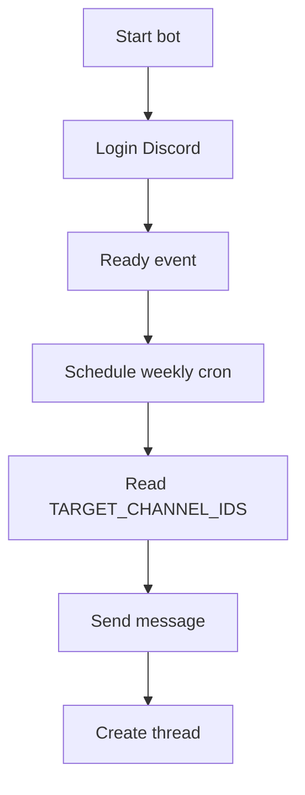

# Discord Cron Job

為了解決夥伴每週都要手動在 Discord 發布訊息的問題，這是一個自動排程機器人，會在每週日早上 9 點於指定的 Discord channel 發送訊息並建立 thread

> 此專案目前設計為私有部署使用，並非公開託管的 Discord Bot 服務。使用者需要自行部署此 bot，並透過環境變數指定要發送訊息的 Discord channel

## Features

- 每週日 09:00 自動執行排程
- 使用 `Asia/Taipei` timezone
- 支援多個 Discord channel IDs
- 自動發送訊息並建立 thread
- Thread 名稱會依照日期自動產生，例如 `Round.01 week02 - 01.07 復盤`；你也可以 fork 此專案，改成自己需要的格式後自行部署

## Tech Stack

- Node.js
- discord.js
- node-cron
- dotenv
- Docker
- Node.js test runner

## Prerequisites

- Node.js 22 或相容版本
- pnpm
- Discord bot token
- Discord channel ID
- Bot 需要被邀請到目標 server
- Bot 需要有 `Send Messages` 與 `Create Public Threads` 權限

## Environment Variables

複製 `.env.example`：

```bash
cp .env.example .env
```

`.env` 需要設定：

```env
DISCORD_TOKEN=""
TARGET_CHANNEL_IDS=""
```

`TARGET_CHANNEL_IDS` 支援多個 channel ID，用逗號分隔：

```env
TARGET_CHANNEL_IDS="123456789012345678,987654321098765432"
```

## Installation

```bash
pnpm install
```

## Run Locally

```bash
pnpm start
```

成功啟動後會看到類似訊息：

```txt
Bot started successfully! Logged in as: <bot-name>
```
使用 `Asia/Taipei` timezone 執行測試


## How It Works



## Docker

Build image：

Docker image 內已設定 `TZ=Asia/Taipei`
```bash
docker build -t discord-weekly-bot .
```

Run container：

```bash
docker run --env-file .env discord-weekly-bot
```

## Screenshot


## Project Structure

```txt
.
├── src
│   ├── index.js              # bot entrypoint & cron schedule
│   └── utils
│       └── formatter.js      # thread name formatter
├── test
│   └── utils
│       └── formatter.spec.js # formatter tests
├── Dockerfile                
└── .env.example              
```

## License
This project is licensed under the MIT License. See [LICENSE](LICENSE) for details.
